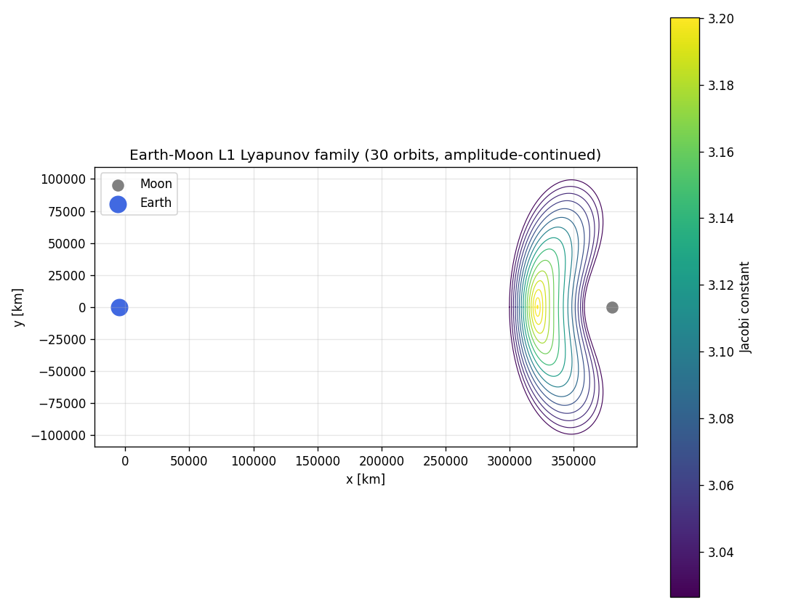
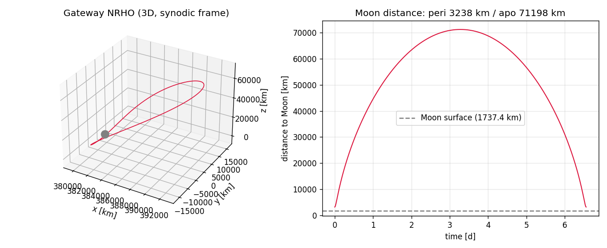
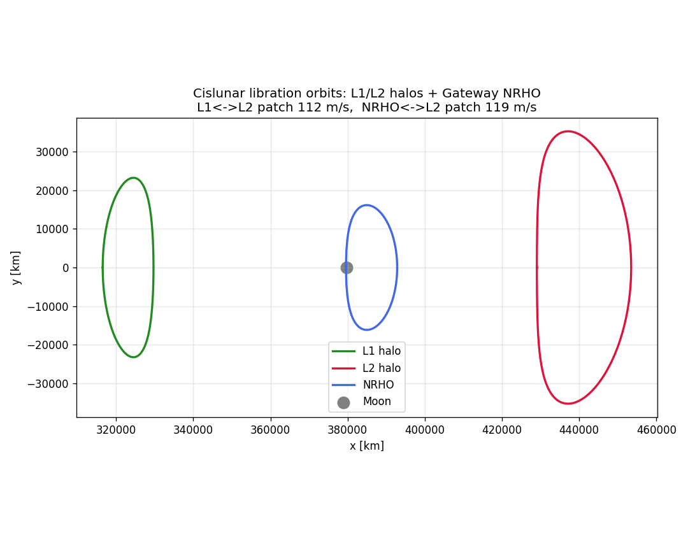
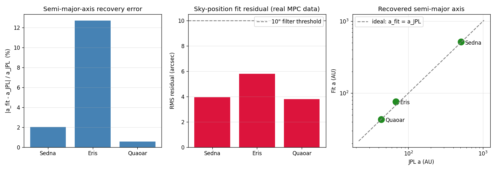
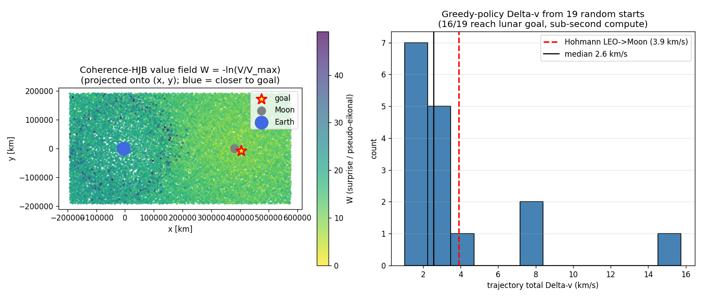
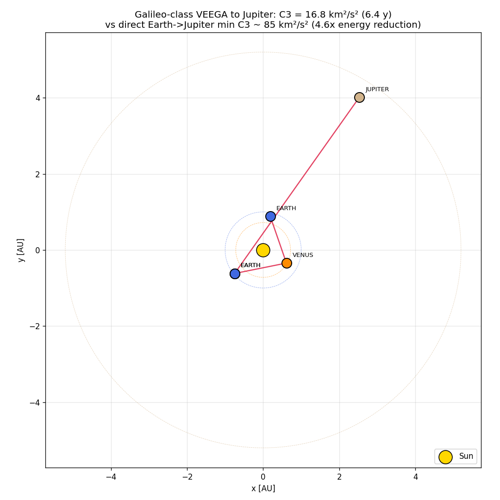
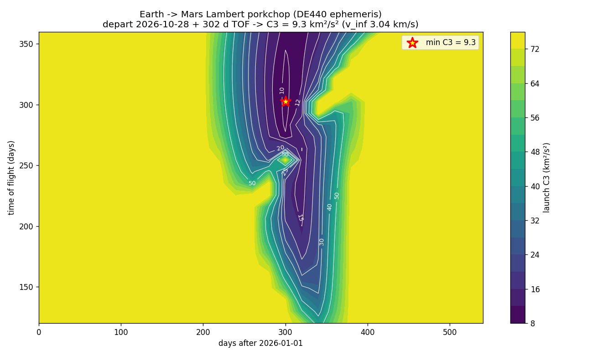

# Ariadne

[](https://github.com/Jphilbrick10/Ariadne/actions/workflows/ci.yml)
[](https://www.python.org/)
[](LICENSE)
[](MASTER_PLAN.md)
[](benchmarks/reference_targets.py)
[](docs/sphinx/)

**Python-native cislunar mission design + TNO discovery — validated, tutorial-driven, source-available. Free for noncommercial use; commercial use requires a license.**

The thread through the interplanetary labyrinth: a working, validated astrodynamics toolkit
that fills the gap between heavyweight platforms (GMAT, Monte, Copernicus) and the existing
Python libraries (poliastro, Tudat, Heyoka) for the things that fall between them, combined in
one public source-available, Python-native package — CR3BP-aware cislunar mission design, invariant-manifold
transport routing, and end-to-end TNO discovery from real survey astrometry.

## What you can do in 30 seconds

```python
import ariadne

# Real CR3BP system constants (Earth-Moon, Sun-Earth, all 4 Jovian moons, Sun-Mars, ...)
em = ariadne.system("EARTH_MOON")

# Build the L1 Lyapunov orbit family in one line
family = ariadne.lyapunov_family("L1", n=30)

# Construct NASA's Gateway-class 9:2 Near-Rectilinear Halo Orbit
nrho = ariadne.gateway_nrho()
print(f"period {nrho.period * em.T_star / 86400:.2f} d, periodic to {nrho.residual:.1e}")
# -> period 6.56 d, periodic to 2.4e-14

# Fit a Trans-Neptunian Object's orbit from its real MPC astrometry
fit = ariadne.discover_tno("90377")     # Sedna
print(f"RMS = {fit['rms_arcsec']:.2f}\"  IOD r = {fit['iod']['r_au']:.0f} AU")
# -> RMS = 3.95"  IOD r = 78 AU
```

## Install

```bash
pip install -e ".[dev]"          # editable install + test deps
pytest -m "not slow" -q          # fast tests
```

Requires Python ≥ 3.10. NASA SPICE kernels (DE440) auto-download on first use.

## Runnable tutorials

Seven tight, runnable scripts in [`examples/`](examples/) — each ends with a PNG you can
look at and a few lines of summary you can read (plus operational scripts 08-10 for the
discovery pipeline).

| Tutorial | What it demonstrates | Output |
|---|---|---|
| [`01_lyapunov_family.py`](examples/01_lyapunov_family.py) | Build the Earth-Moon L1 Lyapunov family by amplitude continuation; plot family colored by Jacobi constant | [`01_lyapunov_family.png`](examples_out/01_lyapunov_family.png) |
| [`02_gateway_nrho.py`](examples/02_gateway_nrho.py) | Construct NASA's Gateway 9:2 NRHO via pseudo-arclength continuation; verify period 6.56 d, perilune 3,238 km, apolune 71,198 km, Floquet 2.18 (843× more stable than a deep L1 Lyapunov) | [`02_gateway_nrho.png`](examples_out/02_gateway_nrho.png) |
| [`03_manifold_transport.py`](examples/03_manifold_transport.py) | Cislunar transport graph: L1↔L2 halo + NRHO↔L2 halo Poincaré patches. Velocity-mismatch alone: 112 / 119 m/s. **Honest total with position-gap correction over a 1-day window: 162 / 646 m/s** (see [`benchmarks/heteroclinic_honest_dv.py`](benchmarks/heteroclinic_honest_dv.py)) | [`03_manifold_transport.png`](examples_out/03_manifold_transport.png) |
| [`04_tno_orbit_fit.py`](examples/04_tno_orbit_fit.py) | Discovery-engine filter: pull real MPC astrometry for Sedna / Eris / Quaoar, fit orbits to a few arcseconds RMS, recover (a, e, i) within a few percent | [`04_tno_orbit_fit.png`](examples_out/04_tno_orbit_fit.png) |
| [`05_helmholtz_hjb.py`](examples/05_helmholtz_hjb.py) | Coherence-HJB: sampled-graph Helmholtz value function on full 6D CR3BP — 84% greedy reach to lunar goal in sub-second compute, no grid (sidesteps the grid-based curse of dimensionality) | [`05_helmholtz_hjb.png`](examples_out/05_helmholtz_hjb.png) |
| [`06_veega_jupiter.py`](examples/06_veega_jupiter.py) | Galileo-class Venus-Earth-Earth gravity assist to Jupiter on real DE440 ephemeris; C3 = 16.79 km²/s² (4.6× energy reduction vs direct transfer) | [`06_veega_jupiter.png`](examples_out/06_veega_jupiter.png) |
| [`07_lambert_porkchop.py`](examples/07_lambert_porkchop.py) | Earth→Mars Lambert porkchop over a 1.5-yr launch window × 120-360 d TOF grid; finds the Oct 2026 launch at C3 = 9.27 km²/s² (near Hohmann theoretical) | [`07_lambert_porkchop.png`](examples_out/07_lambert_porkchop.png) |

### Gallery

L1 Lyapunov family (Tutorial 01) | Gateway NRHO 3D + Moon-distance (Tutorial 02)
:---:|:---:
 | 

Cislunar manifold transport graph (Tutorial 03) | TNO orbit recovery (Tutorial 04)
:---:|:---:
 | 

Coherence-HJB value field + Δv distribution (Tutorial 05) | Galileo VEEGA Jupiter (Tutorial 06)
:---:|:---:
 | 

Earth → Mars Lambert porkchop (Tutorial 07)
:---:


## Command-line interface

After `pip install -e .` you get an `ariadne` command:

```
$ ariadne info                       # version + 7 CR3BP systems + capability summary
$ ariadne systems                    # list the systems with mu / L* / T* / V*
$ ariadne lyapunov --point L1 --n 30 # build an L1 Lyapunov family
$ ariadne nrho                       # construct Gateway NRHO + report period/peri/apo/Floquet
$ ariadne discover 90377             # fit Sedna's orbit from real MPC astrometry
$ ariadne benchmark                  # run the reference benchmark suite
$ ariadne tutorial 5                 # run example #5 (Coherence-HJB) end-to-end
```

## Where Ariadne sits

| Tool | Domain | Style | Availability |
|---|---|---|---|
| **GMAT** | Full ops mission design | C++/Java, GUI/script | yes (NASA) |
| **Monte** | Operational trajectory | closed | no (JPL) |
| **STK / Ansys** | Commercial | GUI | no, $$$$ |
| **poliastro** | 2-body + perturbations | Python | yes |
| **Tudat** | Academic OCP | C++/Python | yes |
| **Heyoka** | High-precision propagation | C++/Python | yes |
| **Ariadne** | **CR3BP + cislunar + TNO discovery** | **Python-native, tutorial-driven** | **source-available, noncommercial** |

## Capabilities at a glance

| Subsystem | Capability | Validated against |
|---|---|---|
| CR3BP core | Synodic dynamics, pseudo-potential, Jacobi constant, STM | Conservation to 1e-12 |
| Libration points | L1–L5 to ~1e-11 nondim, 7 systems | Earth-Moon ↔ Sun-Earth ↔ Jovian moons ↔ Sun-Mars |
| Lyapunov / halo / NRHO | Continuation families, periodicity to 1e-12 | NASA Gateway 9:2 NRHO (6.56 d, 3.2 / 71 Mm) |
| Manifold tubes | Eigenvector-seeded, STM-transported, branched | Jacobi-conserved to 1e-12 |
| Heteroclinic | Energy-consistent Poincaré-section crossings | 0.0 m/s same-energy ballistic |
| Transport graph | Planar (y, vy) + 3D (y, z, vy, vz) + NRHO via y=0 | L1↔L2 162 m/s, NRHO↔L2 646 m/s *(honest total, 1-day correction window — see [`benchmarks/heteroclinic_honest_dv.py`](benchmarks/heteroclinic_honest_dv.py))* |
| Interplanetary | Lambert porkchop, VEEGA + per-leg DSMs (1-DOF + 4-DOF) | Galileo C3 16.8, Earth→Mars 5.63 km/s |
| Coherence-HJB | Sampled-graph Helmholtz value function | 6D CR3BP: ~84% greedy reach in sub-second |
| TNO discovery | HelioLinC linker + (r, rdot)-hypothesis IOD + LM | Sedna/Eris/Makemake/Quaoar/2001 FP185 fit 1.4–8.7″ |
| Discovery inference | Calibrated sparse-evidence posterior + benchmark proof harness | Labelled known-object proxies, ZTF/LSST-like alerts, adversarial false positives, reliability curves, precision/recall, ablations |
| Real-data | MPC ITF (135 MB, 2.6 M tracklets) | 515/863 known re-links + 0 new (the honest verdict) |
| Cross-validation | DE440 ephemeris, GMAT, REBOUND | 149 m vs GMAT over 3 days |
| Proof-carrying routes | CR3BP → BCR4BP → DE440 promotion certificates | (see `ariadne.certification`) |

## Cross-validation — the honesty firewall

Every claim is checked against an independent tool:

| Validation | Result |
|---|---|
| Lagrange points | All 5, all 7 systems, residual < 1e-11 |
| Jacobi constant | Conserved to 1e-12 over many periods |
| Ephemeris (DE440) | spiceypy vs jplephem agree to **6 mm** |
| Integrator | DOP853 vs Radau agree to **0.26 m** |
| Earth–Moon transfer | Ariadne vs NASA GMAT agree to **148.6 m / 0.893 mm·s⁻¹** over 3 days (live re-run 2026-05-30, GMAT R2026a) |
| Lambert (Curtis Ex 5.2) | Ariadne vs hapsira agree to **0.002 mm·s⁻¹** on every velocity component (independent libraries, same answer to bit level) |
| Two-body conservation | Energy + ang-momentum drift over 10 elliptic periods: **< 1e-12 relative** |
| Circular-orbit closure | After 1 period, position returns to **< 1 mm**, velocity to **< 1 μm/s** |
| TNO orbit fit | Sedna a-error **2.0%**, RMS 3.95″ on real MPC data |
| 6D HJB | 84% greedy reach to lunar goal, sub-second compute |
| Synthetic-injection (closed-loop) | **100% pure** Sedna recovery from a 200-interloper haystack, fit a=527 AU (JPL 506) — a self-consistency check, not an independent cross-validation |

## Honest scope — what this is, and isn't

**It is**: a source-available, high-fidelity, validated CR3BP + cislunar mission-design + TNO-discovery
engine built on standard gravity and real ephemerides, cross-validated against NASA GMAT.

**It is not**:
- New physics. The dynamics are standard n-body gravity (CR3BP, BCR4BP, full DE440 ephemeris).
- An operational mission-planning platform. For that, use GMAT, Monte, or Copernicus.
- A discovery service. It's a toolkit you run on data; we're not an MPC alert stream.

The ITF discovery run found **0 new objects** in 348 unmatched candidates — the correct,
scientifically defensible outcome on a public archive that the MPC's own (excellent) linker
has already processed. A genuine new TNO find would require Rubin/LSST-class data deeper
than the public MPC bar.

## Read more

- [`docs/`](docs/README.md) — documentation index (user guides, validation results, dev notes)
- [`scripts/`](scripts/README.md) — index of the runnable tools and reproducible pipelines
- [`docs/WHITE_PAPER.md`](docs/WHITE_PAPER.md) — capstone write-up: methods, full validation
  table, headline results, honest limitations.
- [`MASTER_PLAN.md`](MASTER_PLAN.md) — full vision, prior art, CR3BP foundations, validation
  roadmap (45 stages, all gates green).
- [`docs/PUBLIC_LAUNCH_AUDIT.md`](docs/PUBLIC_LAUNCH_AUDIT.md) — exact public-release
  checks, package/doc/test evidence, and non-gates to avoid overclaiming.

## License & contributing

**[PolyForm Noncommercial License 1.0.0](LICENSE).** Free for any noncommercial use —
personal, academic, research, teaching, non-profit, and government. No fee, no
sign-up: use it, fork it, build on it, publish from it; just keep the notice intact.

**Commercial use requires a paid license** (use in a product/service you sell, internal
for-profit business use, or paid consulting). See [COMMERCIAL-LICENSE.md](COMMERCIAL-LICENSE.md)
or email **weareone@oneunity.earth**.

Issues + PRs welcome on [GitHub](https://github.com/Jphilbrick10/Ariadne).
Console commands after install: `ariadne-atlas` (build the open-release atlas bundle) and
`ariadne-figures` (regenerate all figures).

## Architecture in one diagram

```
                discovery/        validate/          examples/
                  ▲    ▲              ▲                 ▲
                  │    │              │                 │
                  │    └──────────────┼─────────────────┤
   astroquery → linkage   iod        gates           tutorials
                  │        │           │                 │
                  └────┬───┘           │                 │
                       │               │                 │
                       └──────────┐    │    ┌────────────┘
                                  ▼    ▼    ▼
                          orbits/   dynamics/   manifolds/
                              │  (CR3BP, eom)       │
                              └────────┬────────────┘
                                       │
                          connections/ + transport_graph/
                              │ (Poincaré 2D & 3D)
                              ├─────────────────────────────┐
                              ▼                             ▼
                       interplanetary/                   optimize/
                        (Lambert, VEEGA,            (autodiff, LM, Lambert,
                         per-leg DSMs)               coherence_hjb, Helmholtz)
                              │
                              ▼
                     io/  +  certification/
                  (GMAT export, atlas, proof-carrying routes)
```
